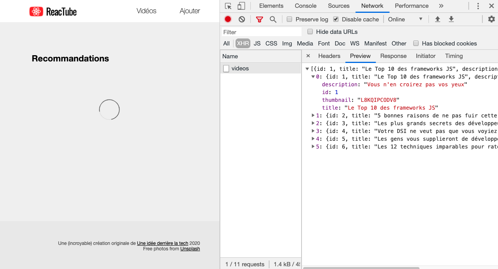
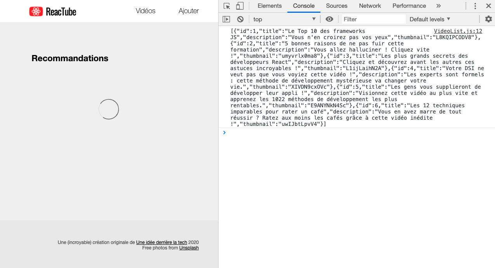
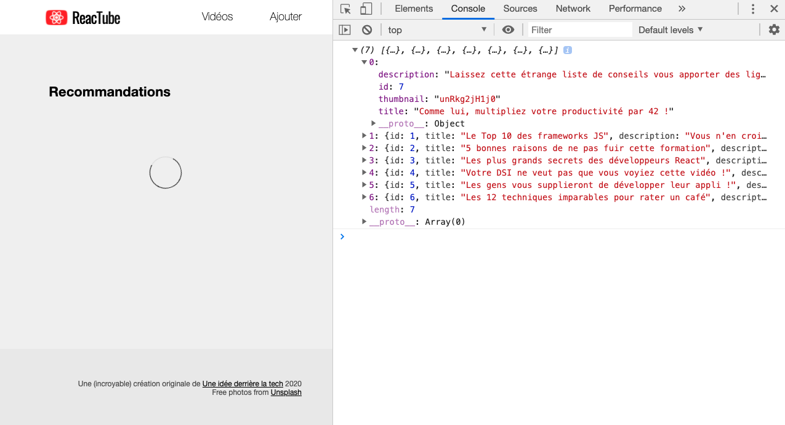
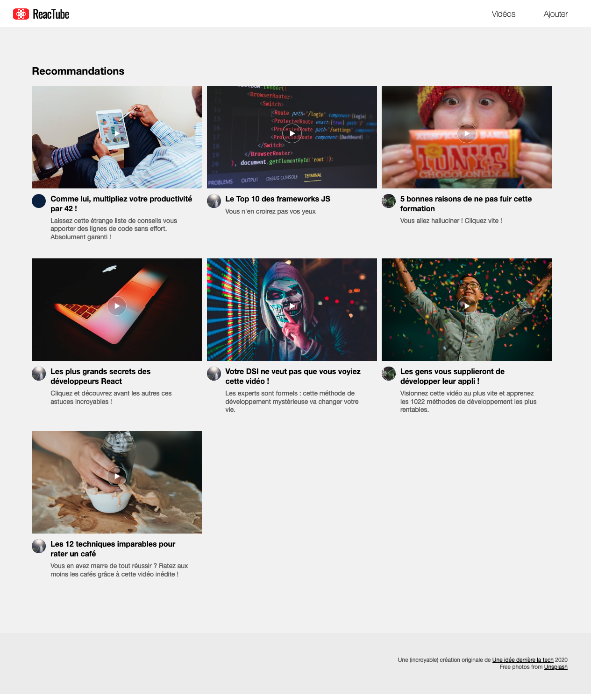

# C. AJAX <!-- omit in toc -->

_**Pour commencer ce TP nous allons connecter notre application React à l'API REST que l'on vient de lancer**_

## Sommaire <!-- omit in toc -->
- [C.1. Rappels : XMLHttpRequest vs fetch](#c1-rappels-xmlhttprequest-vs-fetch)
- [C.2. Chargement de la liste des vidéos](#c2-chargement-de-la-liste-des-vidéos)

## C.1. Rappels : XMLHttpRequest vs fetch
Comme vu en cours (_récupérez si ce n'est pas déjà fait le pdf !_) il existe deux méthodes pour charger/envoyer des données en JS : [XMLHttpRequest](https://developer.mozilla.org/en-US/docs/Web/API/XMLHttpRequest) et l'[API fetch](https://developer.mozilla.org/en-US/docs/Web/API/Fetch_API/Using_Fetch)

**C'est l'API fetch que nous utiliserons dans ce TP.** \
En effet, elle dispose d'une syntaxe plus concise, avec laquelle il est plus facile de chaîner les traitements grâce aux [Promises](https://developer.mozilla.org/fr/docs/Web/JavaScript/Guide/Utiliser_les_promesses).

Pour rappel, le support navigateur de l'API fetch est plutôt bon :

<a href="http://caniuse.com/#feat=fetch">
	<picture>
		<source type="image/webp" srcset="https://caniuse.bitsofco.de/image/fetch.webp">
		
	</picture>
</a>

> _**NB :** Comme on peut le voir, **aucune version d'Internet Explorer n'est compatible avec l'API fetch**. C'est aussi le cas des versions d'android 4.4.4 et inférieures. Heureusement, un [polyfill](https://fr.wikipedia.org/wiki/Polyfill) développé par Github est disponible ici : https://github.com/github/fetch. Sur un projet réel, s'il fallait supporter ces navigateurs anciens, vous devriez mettre en place ce polyfill mais pour gagner du temps nous ignorerons cette problématique dans le TP._

## C.2. Chargement de la liste des vidéos
1. **Commencez par supprimer l'import du module `data.js` dans la `VideoList`.** Comme on va charger les données de la bdd, on n'a plus besoin de cet import (_ne supprimez cependant pas tout de suite le fichier, le `VideoDetail` l'utilise encore... pour l'instant !_)
2. **Supprimez ensuite le `setTimeout(...)` contenu dans la méthode componentDidMount de la `VideoList`.**
3.  **A la place, lancez le chargement de la liste des vidéos avec l'API fetch** :
	```js
	fetch('http://localhost:8080/api/videos');
	```

	Rechargez la page html dans le navigateur et vérifiez dans l'onglet Network/Réseau des devtools que votre page lance bien une requête HTTP vers http://localhost:8080/api/videos :

	

	Maintenant que l'on arrive à lancer la requête, reste à exploiter la réponse renvoyée par le serveur et à utiliser les données qu'elle contient !

4. **Commencez par inspecter la réponse retournée par `fetch()` grâce à la méthode `.then()`** :
	```js
	fetch('http://localhost:8080/api/videos')
		.then( response => console.log(response) );
	```

	Rechargez la page et regardez ce qui s'affiche dans la console : il s'agit d'un objet de type [Response](https://developer.mozilla.org/en-US/docs/Web/API/Response) retourné par l'API fetch.

	Comme vu en cours, cet objet contient notamment des propriétés `ok`, `status` et `statusText` qui permettent d'en savoir plus sur la réponse HTTP retournée par le serveur.

4. **On va maintenant pouvoir récupérer les données brutes contenues dans la réponse HTTP grâce à la méthode [response.text()](https://developer.mozilla.org/en-US/docs/Web/API/Body/text)** :
	```js
	fetch('http://localhost:8080/api/videos')
	  .then( response => response.text() )
	  .then( responseText => console.log(responseText) );
	```
	Vérifiez que la console affiche bien la chaîne au format JSON :

	

	_Maintenant que l'on est capable de récupérer le contenu de la réponse sous forme de chaîne de caractères, il reste encore à **convertir la chaîne JSON en objets JS** !_

5. **Pour convertir la réponse en objets JS, nous avons 2 solutions :**
	- utiliser `response.text()` et `JSON.parse()`
	- ou bien utiliser juste `response.json()`. C'est cette technique que nous allons employer, car elle est quand même beaucoup plus simple :
	```js
	fetch('http://localhost:8080/api/videos')
	  .then( response => response.json() )
	  .then( data => console.log(data) );
	```
	En théorie, vous devriez maintenant voir dans la console, le tableaux de vidéos décodé : vous pouvez utiliser les flèches pour déplier/replier chaque objet et consulter ses propriétés.

	

6. **Maintenant que vous avez réussi à récupérer les infos de la base, que vous les avez converties en données exploitables en JS, reste à les exploiter dans notre `VideoList` simplement à l'aide de `setState()` !**

	```js
	fetch('http://localhost:8080/api/videos')
	  .then( response => response.json() )
	  .then( data => this.setState({videos: data}) );
	```

	

	Ca y est ! La page s'affiche maintenant avec la liste complète des vidéos contenues dans la base de données du serveur REST !! :metal: :tada: :trophy: :pizza: :beers:

## Étape suivante <!-- omit in toc -->
Maintenant que l'on est capables de communiquer avec notre API REST, voyons comment créer un formulaire dans React pour envoyer des données en base : [D. VideoForm](D-VideoForm.md).