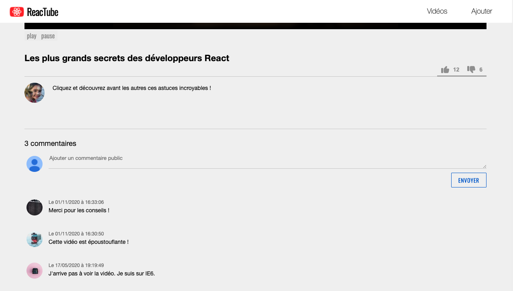

# F. Pour aller plus loin : les commentaires <!-- omit in toc -->

_**Dans ce dernier exercice, je vous propose de mettre en place un système de commentaires dans la page de détail.**_



Plusieurs contraintes :
- le formulaire d'ajout de commentaire doit être un formulaire **contrôlé**
- l'API pour les commentaires est **déjà fournie** :
	- **GET http://localhost:8080/api/videos/1/comments** retourne les commentaires de la vidéo d'id 1
	- **POST http://localhost:8080/api/videos/1/comments** ajoute un nouveau commentaire.

		Le body de la requête sera de la forme :
		```json
		{
			"content": "Le message saisi par l'utilisateur"
		}
		```
- Une fois un commentaire ajouté, la **liste des commentaires doit se rafraîchir**
- le commentaire le plus récent est en haut
- pour chaque commentaire on affiche son contenu et sa date de publication au format `"Le 06/07/2020 à 13:37:42"`
- pendant le chargement l'utilisateur ne doit pas pouvoir saisir de texte ou re-cliquer sur le bouton submit

Voici une proposition de code HTML qui devrait rendre à peu près bien dans la page :
```html
<aside class="commentList">
	<h2>X commentaires</h2>
	<form class="commentForm">
		<textarea
			name="content"
			rows="2"
			placeholder="Ajouter un commentaire public"
		></textarea>
		<button type="submit">Envoyer</button>
	</form>
	<article class="commentRenderer">
		<time datetime="2020-06-08 22:40:41">Le 08/06/2020 à 22:40:41</time>
		<p>Génial ! Vive React</p>
	</article>
</aside>
```